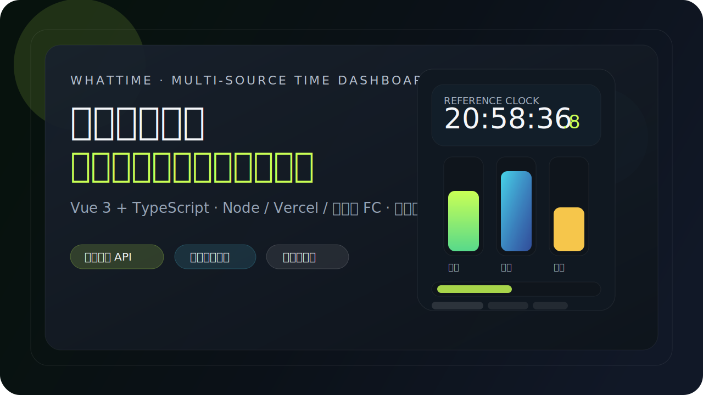
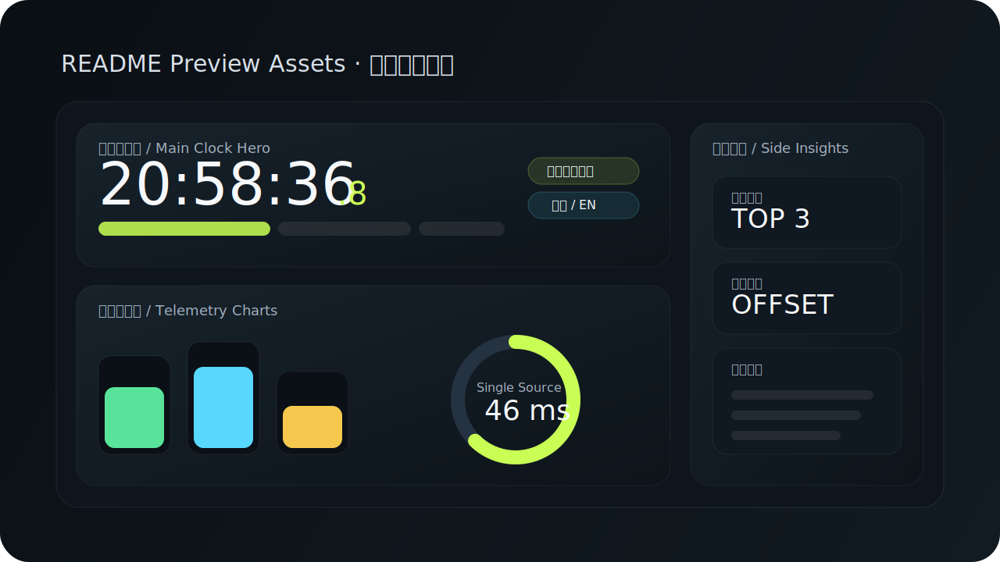

<div align="center">



# WhatTime · 多源时间看板

一个围绕 **“时间读数”** 打磨的多源时间控制台。它会同时拉取多个时间源，聚合、校准、显示延迟与偏差，并提供 **动态图表、PiP 主时钟、深浅主题、中英切换** 等能力。

<p>
  
  
  
  
</p>

<p>
  <a href="https://time.openrealm.cn"><strong>在线体验</strong></a>
  ·
  <a href="#快速开始"><strong>快速开始</strong></a>
  ·
  <a href="#api-接口"><strong>API 接口</strong></a>
  ·
  <a href="#部署说明"><strong>部署说明</strong></a>
</p>

</div>

---

## 这是什么？

> 它不是“简单把几个时间接口摆在一起”。
>
> 它更像一个 **多源时间观测台**：
> - 同步查看多个平台时间
> - 感知不同源的网络延迟与本地偏差
> - 在失败时回退到最近成功值
> - 通过图表和主时钟卡片，把“当前时间状态”一眼讲清楚

当前项目适合用于：
- 时间源对比 / 观测
- 前端控制台与状态面板示例
- Vercel / Node / 阿里云 FC 的轻量聚合服务示例
- UI / 动效 / 仪表盘设计练习项目

---

## 核心亮点

### 1) 主时钟优先
- 顶部 **主时钟卡片** 置顶展示
- 可切换主时钟源（中位数 / 淘宝 / 美团 / 苏宁）
- 支持毫秒显示、刷新间隔调整、手动校准
- 支持 **Picture-in-Picture 主时钟**

### 2) 多源聚合与回退策略
- 聚合多个时间接口：**淘宝 / 美团 / 苏宁**
- 自动区分三种状态：
  - `ok`：本次拉取成功
  - `stale`：本次失败，回退到上次成功值
  - `error`：没有历史成功值且本次失败
- 服务端支持缓存与 in-flight 去重，减少抖动和重复请求

### 3) 动态图表舱
- 新增 **Telemetry Charts** 图表模块
- 支持：
  - **多源对比模式**：对比多个数据源
  - **单源聚焦模式**：聚焦单一源的延迟/偏差
- 支持图表维度切换：
  - 延迟（Latency）
  - 偏差（Offset）
- 带动画柱状图与环形读数效果，适合快速扫读

### 4) 主题与语言切换
- 支持 **深色 / 浅色主题**
- 支持 **中文 / EN** 切换
- 切换状态会持久化到本地存储

### 5) 多环境部署
- 本地 Node 服务运行
- 适配 **Vercel Serverless Function**
- 提供 **阿里云 FC** 部署示例

---

## 界面预览

### 仪表盘构成



### 部署与运行流


---

## 功能总览

- [x] 多源时间聚合（淘宝 / 美团 / 苏宁）
- [x] 主时钟读数与中位数参考源
- [x] 自动校准 / 手动校准
- [x] 延迟排名 / 偏差排名
- [x] 回退数据源展示（stale）
- [x] 最近错误日志
- [x] 动态图表舱（多源 / 单源）
- [x] 深浅主题切换
- [x] 中文 / EN 切换
- [x] 移动端适配
- [x] PiP 主时钟
- [x] Vercel / Node / 阿里云 FC 兼容

---

## 技术栈

### 前端
- **Vue 3**
- **TypeScript**
- **Vite**
- 原生 CSS（定制化仪表盘视觉与动效）

### 服务端 / 接口层
- Node HTTP Server
- Vercel Serverless Function：`api/time/aggregate.ts`
- 阿里云 FC（通过 `s.yaml`）

### 测试
- **Vitest**
- `@vue/test-utils`
- `jsdom`

---

## 快速开始

### 安装依赖

```bash
npm install
```

### 本地开发

```bash
npm run dev
```

默认地址：
- 前端：`http://localhost:5173`
- 服务端：`http://localhost:9000`

### 生产构建

```bash
npm run build
npm run start
```

### 运行测试

```bash
npm test
```

---

## API 接口

### `GET /api/time/aggregate`

返回所有时间源的聚合结果。

#### 示例返回

```json
{
  "generatedAtMs": 1773552466000,
  "cacheAgeMs": 0,
  "sources": {
    "taobao": {
      "source": "taobao",
      "status": "ok",
      "serverTimeMs": 1773552465534,
      "serverTimeISO": "2026-03-15T05:27:45.534Z",
      "localDiffMs": -40,
      "latencyMs": 35,
      "fetchedAtMs": 1773552465574,
      "raw": {},
      "staleFromLastSuccess": false
    }
  }
}
```

#### 字段说明

| 字段 | 说明 |
| --- | --- |
| `generatedAtMs` | 本次聚合生成时间 |
| `cacheAgeMs` | 当前缓存年龄 |
| `source` | 数据源标识 |
| `status` | `ok / stale / error` |
| `serverTimeMs` | 服务端返回的时间戳 |
| `localDiffMs` | 本地与远端时间差 |
| `latencyMs` | 当前请求延迟 |
| `fetchedAtMs` | 当前源数据抓取时间 |
| `staleFromLastSuccess` | 是否来自上次成功值回退 |

#### 状态语义

- `ok`：当前拉取成功
- `stale`：当前失败，但存在最近成功值，已回退显示
- `error`：当前失败，且没有历史成功值可回退

---

## 项目结构

```text
WhatTimeApi/
├─ api/                    # Vercel Serverless Functions
├─ server/                 # Node 服务器入口与聚合逻辑
├─ src/
│  ├─ components/          # 主时钟、图表、排名、错误日志、分组展示等组件
│  ├─ composables/         # 仪表盘状态、PiP、主题与语言切换逻辑
│  ├─ constants/           # 常量与平台元信息
│  ├─ utils/               # 时间格式化等工具函数
│  └─ style.css            # 全局样式与动效
├─ tests/                  # 测试
├─ vercel.json             # Vercel 配置
├─ s.yaml                  # 阿里云 FC 配置示例
└─ README.md
```

---

## 架构概览

```mermaid
flowchart LR
    A[Vue Dashboard] --> B[/api/time/aggregate]
    B --> C[淘宝时间源]
    B --> D[美团时间源]
    B --> E[苏宁时间源]
    B --> F[缓存 / 去重 / 回退逻辑]
    A --> G[主时钟卡片]
    A --> H[动态图表舱]
    A --> I[排名与错误日志]
```

---

## 配置项

<details>
<summary><strong>环境变量说明</strong></summary>

可参考 `.env.example`：

- `PORT`：Web 服务端口，默认 `9000`
- `STATIC_DIR`：静态文件目录，默认 `dist/client`
- `TIME_CACHE_TTL_MS`：聚合缓存 TTL，默认 `1000`
- `TIME_REQUEST_TIMEOUT_MS`：单请求超时，默认 `1200`
- `TZ`：时区，建议 `Asia/Shanghai`

</details>

---

## 部署说明

### Vercel

本仓库已适配 Vercel：
- 前端由 Vite 构建为静态资源
- `api/time/aggregate.ts` 提供 Serverless API
- `vercel.json` 已处理 SPA 路由重写

部署步骤：

1. 在 Vercel 导入仓库
2. Framework Preset 选择 **Vite**（通常会自动识别）
3. Build Command 使用：

   ```bash
   npm run build:client
   ```

4. 部署完成后访问：
   - 页面：`/`
   - 接口：`/api/time/aggregate`

> 本地 `npm run dev` 仍走 Node + Vite；线上 Vercel 走 `api/` Serverless Function。

### 阿里云 FC

1. 构建项目：

   ```bash
   npm run build
   ```

2. 安装并登录 Serverless Devs（`s`）
3. 根目录执行：

   ```bash
   s deploy
   ```

4. 访问 FC 的 HTTP Trigger 地址

仓库中提供了 `s.yaml`（FC3）示例，可按你的服务名、地域和账号配置修改。

---

## README 小贴士

这个项目的 README 额外加入了：
- SVG 封面图
- 模块预览图
- 部署流示意图
- Mermaid 架构图
- `<details>` 折叠说明
- 完整的快速开始、接口、结构与部署文档

如果你要继续扩展，这里很适合再加入：
- 实际在线截图
- 演示 GIF
- 更新日志 / Roadmap
- 常见问题（FAQ）

---

## Roadmap

- [ ] 增加更完整的时间序列历史图
- [ ] 支持更多时间源接入
- [ ] 更细粒度的语言本地化（时间格式 / 错误日志）
- [ ] 可配置的图表主题与导出
- [ ] 更丰富的部署文档与监控建议

---

## 贡献

欢迎继续补充：
- 新时间源
- 新图表样式
- 更完整的国际化
- 更精细的动画与移动端体验
- 更完善的测试覆盖

如果你要把它打磨成一个更完整的 showcase 项目，README 现在已经可以作为一个比较完整的对外展示入口。
